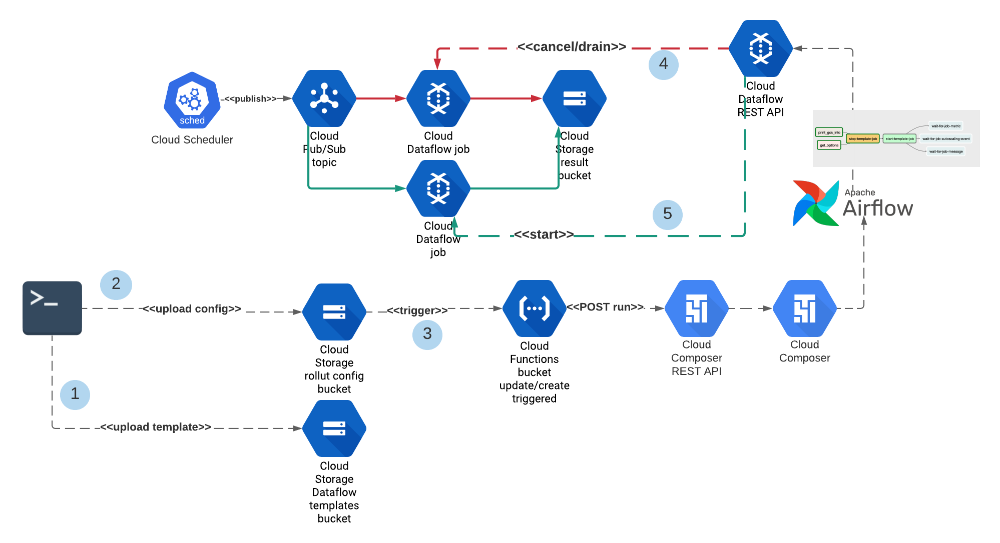
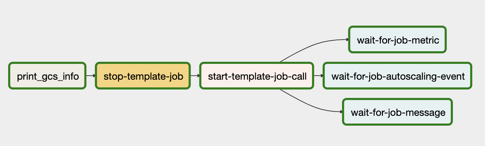

# Cloud Composer Dataflow Deployer

This repo illustrates how to trigger an Airflow DAG to re-deploy Dataflow jobs. 

High level components:

- [airflow](airflow) folder contains the main DAG to orchestrate updating Dataflow jobs. 
The implementation of custom operator DataflowTemplatedJobStopOperator is provided which is used in the main DAG.

- [cloud-functions](cloud-functions) folder contains the logic to externally trigger the DAG upon Cloud Storage bucket's 
create/update event. Deploy configs like [rollout.json](example/rollout.json) is pushed to the bucket, which triggers the 
cloud function. 
  
- [example](example) folder contains an end to end example on how to provision GCP resources and triggering 
deployments with a single command and JSON file which has the runtime parameters and configuration. 
The Dataflow job is extended from [this example](https://cloud.google.com/pubsub/docs/pubsub-dataflow#python) to include
runtime value providers. 
